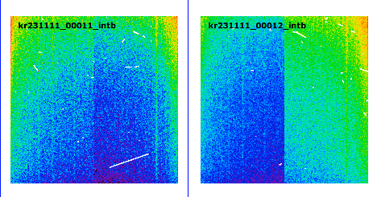
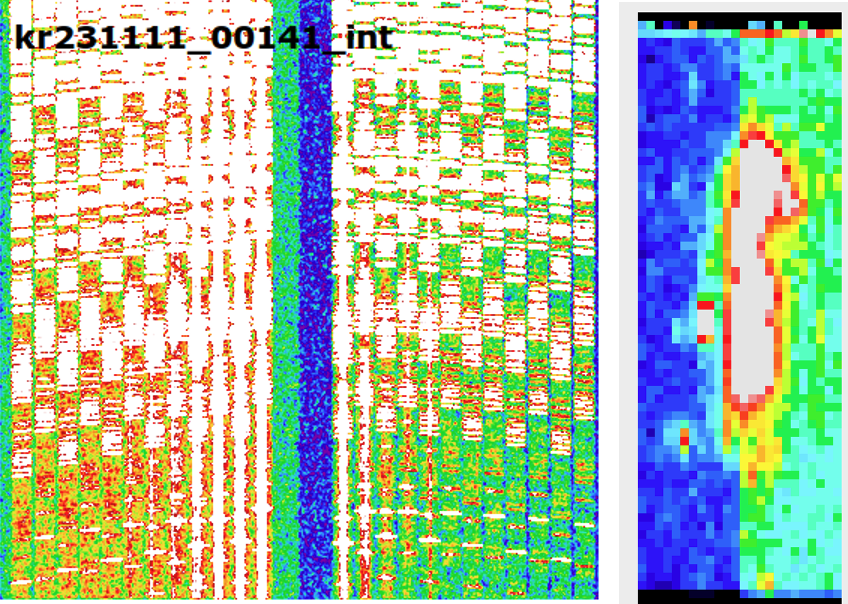
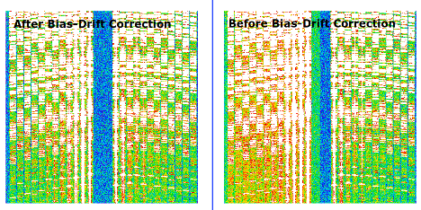

# KCWI Bias Drift Correction

## Overview

Some KCWI datasets exhibit a **bias drift** effect, where the bias level difference between the science region and the overscan region changes from exposure to exposure.

This effect can produce noticeable background discontinuities between the left and right amplifier regions, particularly in short-exposure observations.

The KCWIKit version of the KCWI DRP includes an optional bias-drift correction routine to mitigate this issue.



*Figure 1. Two consecutive overscan-subtracted bias frames showing the bias drift effect in KCRM. The residual bias offset between the left and right amplifiers changes sign between exposures, indicating that the bias difference between the science and overscan regions is not constant.*

---

## The Problem

KCWI uses two amplifiers for science frames. In some datasets, the overscan subtraction does not fully remove the bias offset because the relationship between the science section and overscan section drifts over time.

This behavior can be seen in consecutive bias frames:

* One exposure may show the left amplifier at a higher residual level.
* The next exposure may show the opposite behavior.
* The sign and amplitude of the residual offset can change between exposures.

As a result, reduced science frames may display an artificial background structure across the field of view, often appearing as a discontinuity between the two amplifier halves.



*Figure 2. The bias drift create background residual in the science frame.*

---

## When Is It Most Important?

The effect becomes increasingly significant for:

* **Short exposure times**
* **Low-background observations**
* **Faint targets**

This occurs because the bias drift contribution becomes large relative to the total signal:

[
\frac{\text{Bias Drift}}{\text{Exposure Time}}
]

For long integrations, the effect is generally less noticeable because the accumulated source and sky counts dominate over the residual bias offset.

---

## Bias Drift Correction in KCWIKit

KCWIKit provides an optional correction routine that attempts to remove the amplifier-to-amplifier bias mismatch.

### Method

The algorithm:

1. Measures the background level in the central gap region between the two amplifiers.
2. Computes the relative offset between the amplifier halves.
3. Applies a correction to bring the two sides to the same background level.

This significantly reduces the artificial amplifier boundary seen in affected science frames.



*Figure 3. Applying the bias drift correction reduces the background structure.*

---

## Limitations and Caveats

⚠️ **Use with caution**

The central region used for bias-drift estimation is also the region normally used for scattered-light subtraction.

For this reason:

* The correction has been primarily tested on science frames.
* The central gap in long exposures observations may be dominated by scattered light, instead of bias drifts.
* Bright targets or observations with significant scattered light also contaminate the central gap.
* Additional validation is recommended before enabling the correction for all datasets.

To minimize risk, the current implementation only operates on science frames with short exposure times (<=600s).

---

## Enabling Bias Drift Correction

Edit your `kcwi.cfg` file and add:

```ini
BIASDRIFT = True
BD_MAXEXPTIME = 600
```

### Parameters

| Parameter       | Description                                                                |
| --------------- | -------------------------------------------------------------------------- |
| `BIASDRIFT`     | Enable or disable bias drift correction                                    |
| `BD_MAXEXPTIME` | Maximum exposure time (seconds) for which bias drift correction is applied |

---

## Recommendations

| Observation Type                     | Recommendation            |
| ------------------------------------ | ------------------------- |
| Short exposures (<600 s)             | Enable correction         |
| Faint targets                        | Enable correction         |
| Long exposures                       | Usually unnecessary       |

---

## Summary

The KCWI bias drift effect arises from exposure-to-exposure changes in the residual bias offset between the science and overscan regions of each amplifier. This can introduce artificial background structures across the field of view, particularly in short exposures.

KCWIKit provides an optional correction routine that aligns the amplifier background levels using the central detector region. For most short-exposure science observations, enabling this correction can substantially improve image uniformity.

```ini
BIASDRIFT = True
BD_MAXEXPTIME = 600
```
