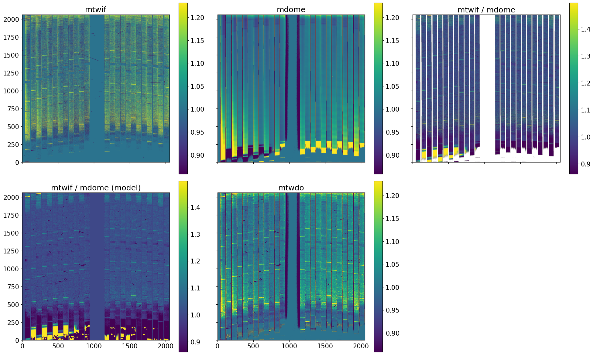
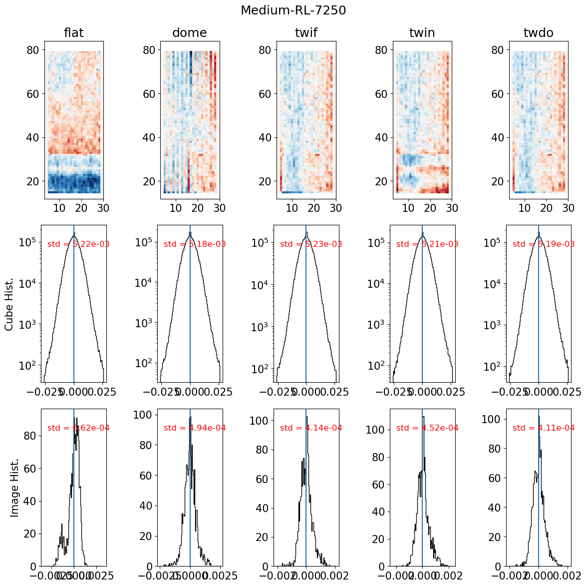
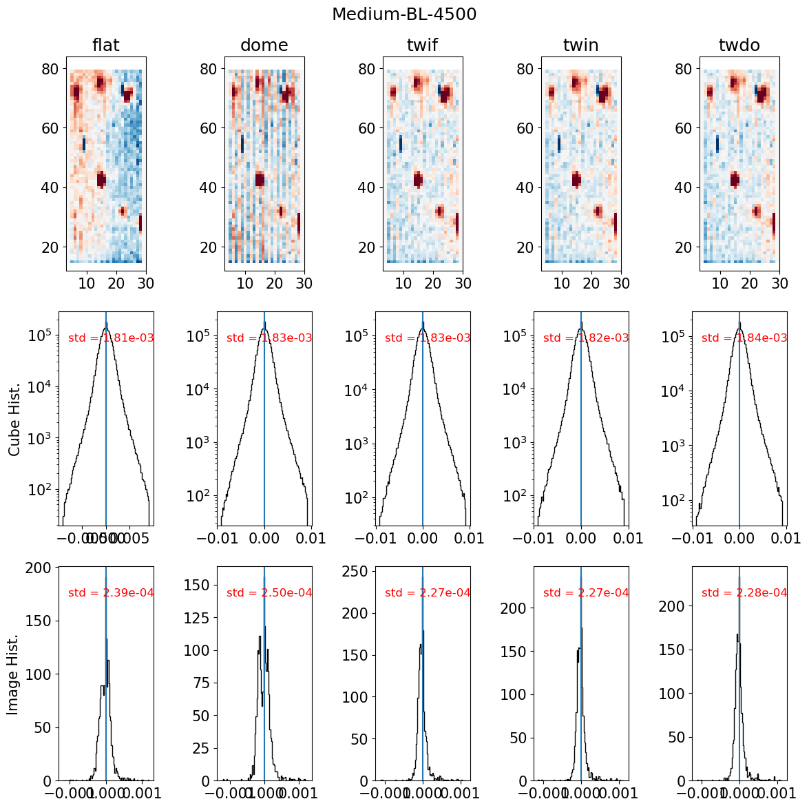
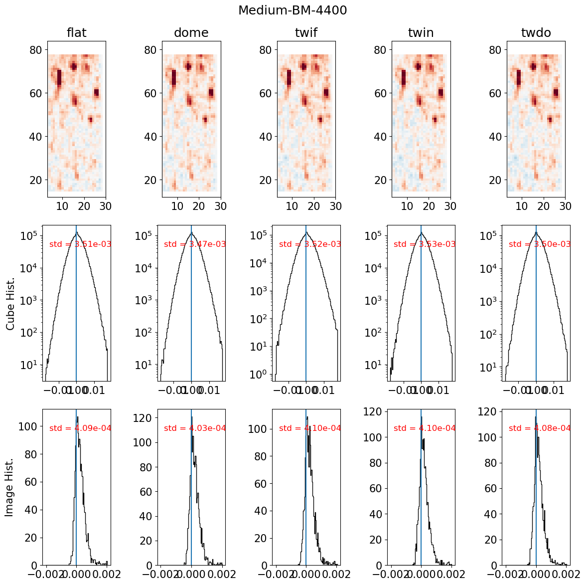
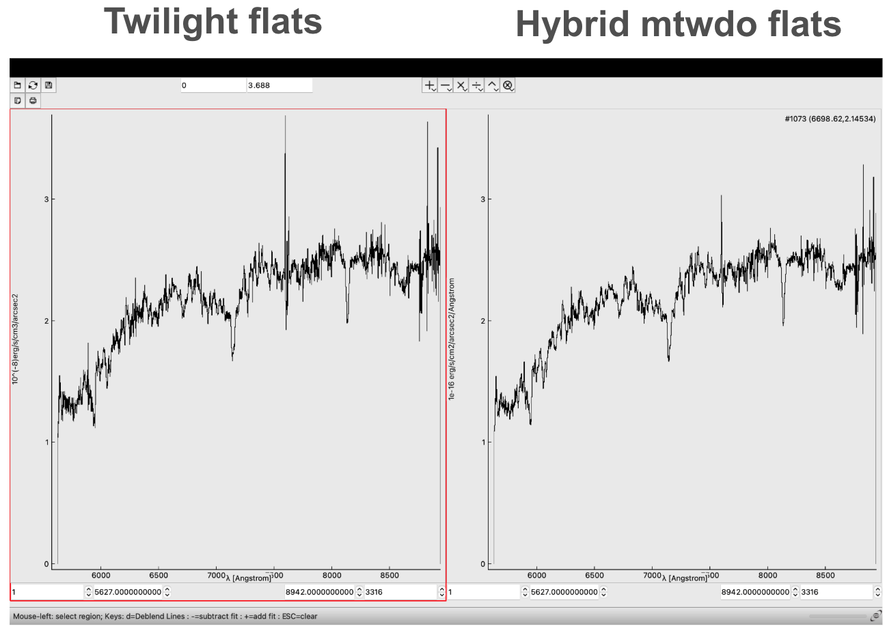

# Tips on Choosing the Flat Field

## Overview

There are three primary types of flat fields provided by the observatory:

- **Internal lamp flat**: `mflat`  
- **Dome flat**: `mdome`  
- **Twilight flat**: `mtwif` (obtained by observers during morning or evening twilight)

The original DRP prioritizes flats in the following order:

```
[mflat, mdome, mtwif]
```

In **KCWIKit**, this priority can be modified using the `flat_order` keyword in the `kcwi.cfg` file.

---

## Hybrid Flats

KCWIKit can also generate two types of **hybrid flats**:

- `mtwin` (twilight-corrected internal flat)  
- `mtwdo` (twilight-corrected dome flat)

To enable this feature, set:

```
makehybridflat = True
```


### How hybrid flats work

Hybrid flats use **2D B-spline modeling** to adjust the illumination pattern of:

- internal flats (`mtwin`), or  
- dome flats (`mtwdo`)  

so that they match the **twilight illumination pattern**, while retaining the **higher S/N** of internal or dome flats.

**Example:**



---

## General Recommendations

### 1. Always prioritize twilight flats (`mtwif`)

Twilight flats best reproduce the **true spatial illumination pattern**.

- Dome and internal flats can fail under certain conditions.
- Twilight flats are the most physically reliable reference.

---

### 2. Challenge: low S/N in red wavelengths

In the red channel:

- Twilight is significantly fainter  
- Exposure times can reach **several minutes per frame**  
- Low S/N twilight flats can introduce **noise into science data**

**Solution:** Use hybrid flats:

- Use `mtwdo`  
- Preserve twilight illumination pattern  
- Achieve higher S/N

---

## Behavior of Different Flat Types

### Dome flats (`mdome`)

**Pros:**
- Generally close to true illumination pattern

**Cons:**
- In **BL** and **RL gratings**, exhibit a **checkerboard pattern**
  - Present in both spatial and wavelength dimensions
  - Leads to structured **sky background residuals**

**Exception:**
- **BM grating**
  - Works well if wavelength range does not have near-UV (< ~4000 Å), where the
  dome lamps are not efficient.

---

### Internal flats (`mflat`)

**Cons:**
- Poorly reproduce illumination pattern
- Introduce systematic artifacts:
  - Large-scale **background gradients** (commonly reported in literature)
  - In red channel: **vignetting "ledge" structure**

**Conclusion:**
- Generally **not recommended as primary flats**

---

## Recommended Flat Priority (by Setup)

| Grating | CWAVE | flat1 | flat2 | flat3 | flat4 | flat5 |
|---------|-------|-------|-------|-------|-------|-------|
| RL      | 7250  | mtwdo | mtwif | mdome | mtwin | mflat |
| RL      | 8000  | mtwdo | mtwif | mdome | mtwin | mflat |
| BL      | 4500  | mtwif | mflat | mdome | mtwdo | mtwin |
| BM      | 4400  | mdome | mtwif | mflat | mtwin | mtwdo |

---

## Diagnostic Examples

### RL (7250 Å)



---

### BL (4500 Å)



---

### BM (4400 Å)



---

### Comparing galaxy spectra from mtwif and mtwdo flats (credit: Kaustubh Gupta)



